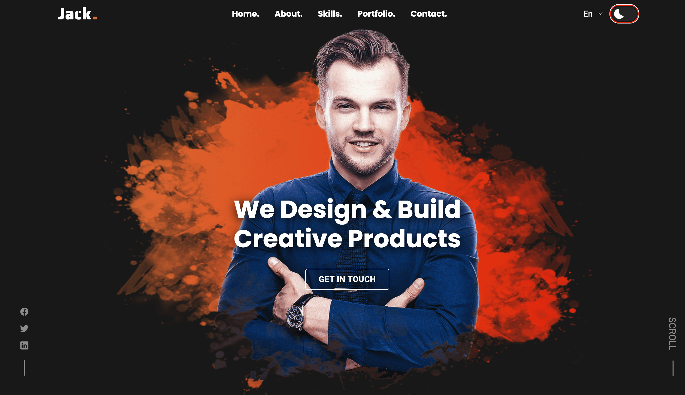
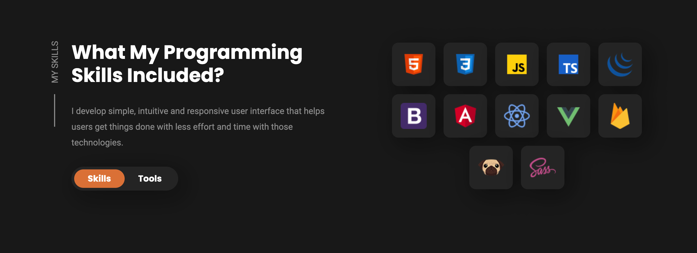

# Jack Portfolio

**Jack Portfolio** is a professional, customizable portfolio template designed to highlight the skills, projects, and experience of developers, designers, and other creatives. It combines a modern design with an intuitive layout to create an impressive online presence.

## Table of Contents📚

1. [Introduction🚀](#introduction)
2. [Features🛠️](#features)
3. [Tech Stack⚙️](#tech-stack)
4. [Screenshot📷](#screenshot)
5. [Getting Started🎯](#getting-started)
6. [Prerequisites📋](#prerequisites)
7. [Installation⚙️](#installation)
8. [Usage📈](#usage)
9. [Customization🖌️](#customization)
10. [Contributing❤️](#contributing)
11. [License📝](#license)

## Introduction🚀

**Jack Portfolio** is designed to be an elegant, fully responsive portfolio that provides sections for personal information, projects, skills, and contact details. It’s perfect for showcasing personal work and making a lasting impression.

## Features🛠️

- **Modern Design:** A clean and visually appealing layout with engaging animations.
- **Responsive:** Works flawlessly on all devices including mobile, tablet, and desktop.
- **Customizable Sections:** Include an introduction, projects, skills, experience, and contact form.
- **Interactive Animations:** Smooth transitions and animations enhance user experience.
- **SEO Optimized:** Built with SEO best practices to improve visibility on search engines.
  
## Tech Stack⚙️

- **ReactJS:** For building the user interface and interactive components.
- **Next.js:** For server-side rendering and optimized performance.
- **Styled-Components:** For reusable, modular CSS-in-JS.
- **Framer Motion:** Adds smooth and intuitive animations.
- **EmailJS (optional):** Integrates with the contact form to send emails without a backend.

## Screenshot📷





## Getting Started🎯

To set up **Jack Portfolio** locally, follow these steps:

1. Clone the repository.
2. Install the required dependencies.
3. Customize it with your own content.
4. Run the application to view your portfolio locally.

## Prerequisites📋

- Node.js (version 14 or higher)
- npm or yarn
- A modern web browser

## Installation⚙️

1. Clone the repository:
   ```bash
   git clone https://github.com/BoddepallyVenkatesh06/Jack-Portfolio.git
   ```

2. Navigate to the project directory:
   ```bash
   cd jack-portfolio
   ```

3. Install dependencies:
   ```bash
   npm install
   ```
   or
   ```bash
   yarn install
   ```

4. Start the application in development mode:
   ```bash
   npm run dev
   ```
   or
   ```bash
   yarn dev
   ```

5. Open the application in your browser at `http://localhost:3000`.

## Usage📈

Once running, you can:

- Explore different sections like projects, skills, and contact information.
- Update each section with your own details to make the template truly yours.

## Customization🖌️

1. **Edit Content:** Update the content in the data files to add your projects, skills, and experiences.
2. **Styling:** Use the styled-components setup to easily change colors, fonts, and layout.
3. **EmailJS Setup (optional):** Add your EmailJS credentials to enable the contact form.

## Contributing❤️

Contributions are welcome! Here’s how:

1. Fork the repository.
2. Create a new branch with your feature or improvement.
3. Make your changes and commit with clear messages.
4. Push to your forked repository.
5. Submit a pull request.

## License📝

MIT License

Copyright (c) 2024 Venky Kumar

Permission is hereby granted, free of charge, to any person obtaining a copy
of this software and associated documentation files (the "Software"), to deal
in the Software without restriction, including without limitation the rights
to use, copy, modify, merge, publish, distribute, sublicense, and/or sell
copies of the Software, and to permit persons to whom the Software is
furnished to do so, subject to the following conditions:

The above copyright notice and this permission notice shall be included in all
copies or substantial portions of the Software.

THE SOFTWARE IS PROVIDED "AS IS", WITHOUT WARRANTY OF ANY KIND, EXPRESS OR
IMPLIED, INCLUDING BUT NOT LIMITED TO THE WARRANTIES OF MERCHANTABILITY,
FITNESS FOR A PARTICULAR PURPOSE AND NONINFRINGEMENT. IN NO EVENT SHALL THE
AUTHORS OR COPYRIGHT HOLDERS BE LIABLE FOR ANY CLAIM, DAMAGES OR OTHER
LIABILITY, WHETHER IN AN ACTION OF CONTRACT, TORT OR OTHERWISE, ARISING FROM,
OUT OF OR IN CONNECTION WITH THE SOFTWARE OR THE USE OR OTHER DEALINGS IN THE
SOFTWARE.